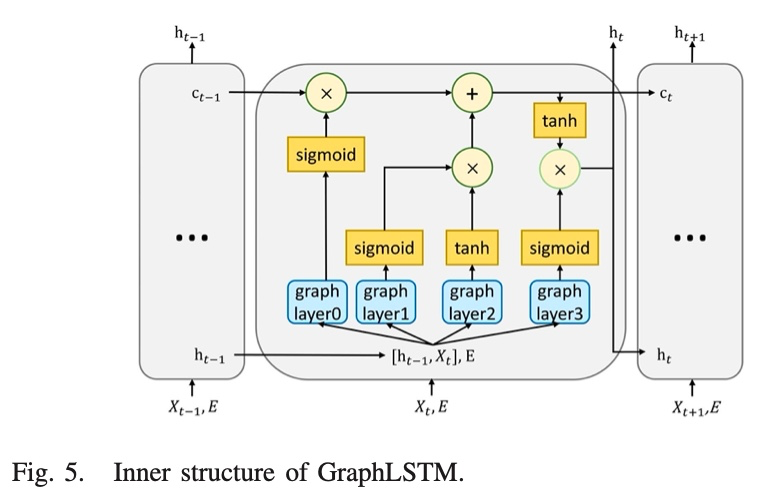

## 总结

要解决什么问题（领域+本文）

- 对于拓扑多变量时间序列的异常检测任务是：给定个历史滑动窗口的数据$S(X\_t∣X\_{t−w:t−1},E)$来判定观测点$X\_t$的数据是否异常。

值得借鉴的地方有哪些

- Spatiotemporal
- 实验非常充分，7个RQ

不足有哪些

- 模型太复杂了

## Spatiotemporal

标题 “A Spatiotemporal Deep Learning Approach for Unsupervised Anomaly Detection in Cloud Systems”中的Spatiotemproal的解读：

- Temporal Model：时序模型（LSTM）
- Spatial Model：空间模型（Graph）

Multiple-Metrics拓扑信息的+组件级的输入构成了系统级的信息，可以更全面地了解整个运行系统。利用Multiple-Metrics就可以用来构造空间模型。

## GraphLSTM

那么Spatiotemporal是如何体现的？

图神经网络的特征提取器共享于来自不同组件的同类指标之间，有助于在统一的特征学习下捕获相同指标类型之间的相似模式。

GraphLSTM的主要思路是将LSTM中的全连接网络之前增加一个GNN，对拓扑信息和指标信息进行融合。

数据分为两类（如Fig.3、Fig.4所示）：

1. 指标矩阵，横坐标是节点Node，纵坐标是指标Metric。
2. 连接矩阵，主要是edge的向量矩阵，每个edge为一个列向量。


GraphLSTM的主要思路是将LSTM中的全连接网络之前增加一个GNN，对拓扑信息和指标信息进行融合。



对比一下LSTM的计算公式和融合后的公式，替换了外部输入。也就在之前添加了GNN作为拓扑信息和Metric信息的融合层，融合之后作为标准LSTM的输入。其中： “$∗g$” denotes the graph neural operator and “$∗$” denotes the Hadamard product。

融合公式和LSTM原公式相比就是多了后面的$E$：


## 实验&数据集

RQ可以写7个？？！！没毛病。这7个RQ选取的角度其实很全面，非常值得参考。

两个数据集MBD和MMS可以看看里面长什么样子，取一行看一下也知道个大概，和Fig.4模型的input一起看比较清晰：

### MDB

Metric类型（[……]处省略了近百个metric）：

```
---------labels-----------
date,cpu.mean_usage_idle,cpu.mean_usage_iowait,cpu.mean_usage_softirq,cpu.mean_usage_system,cpu.mean_usage_user,disk.mean_used_percent,diskio.io_time,diskio.mean_iops_in_progress,diskio.read_speed,diskio.write_speed,kernel.mean_entropy_avail,mem.last_used_percent,mem.mean_active,mem.mean_available_percent,mem.mean_cached,[……]
-----------data-----------
2020-03-25 00:00:00,94.82029603732626,4.731826456427614,0.008321694948441248,0.141826957129186,0.2920010652943856,7.985156212333378,41.61666666666667,0.3958333333333333,0.0,12834.133333333333,824.6666666666665,16.23554618798877,2337374890.6666665,81.55455767777975,1008762197.3333334,163840.0,9480529237.333334,6116.766666666666,5539.033333333334,1.0,0.8333333333333334,0.0,141.0,[……]
[……]
```

Array E即Edge关系如下：

```
[[0, 1, 0, 2, 0, 3, 0, 4], [1, 0, 2, 0, 3, 0, 4, 0]]
```

### MMS数据集（Hipster Shop）

Metric类型（[……]省略了近百个metric），

```
---------labels-----------
TimeStamp,adservice-76469b5944-9tlwk,adservice-76469b5944-9tlwk,adservice-76469b5944-9tlwk,adservice-76469b5944-9tlwk,adservice-76469b5944-9tlwk,[……],label
.CpuUsage(m),MemoryUsage(Mi),NetworkReceiveBytes,NetworkTransmitBytes,PodLatency(s),PodSuccessRate(%),PodWorkload(Ops),CpuUsage(m),MemoryUsage(Mi),NetworkReceiveBytes,[……]
-----------data-----------
2020-04-02 14:45:00,2.5799678782536297,145.703125,2109.643980995866,10315.049052878383,0.0046,95.83333333333334,3.1997866808879407,2.3337262993843577,140.16796875,2035.0993928304085,8568.410546452633,0.004691489361702128,100.0,3.26644890340644,2.0032838708700327,[……]
[……]
```

Array E即Edge关系如下：

```
[[0, 0, 0, 0, 0, 0, 1, 1, 1, 1, 1, 1, 2, 2, 2, 2, 2, 2, 3, 3, 3, 3, 3, 3, 21, 21, 21, 21, 22, 22, 22, 22, 23, 23, 23, 23, 24, 24, 24, 24, 25, 25, 25, 25, 26, 26, 26, 26, 4, 4, 4, 4, 4, 4, 5, 5, 5, 5, 5, 5, 6, 6, 6, 6, 6, 6, 7, 7, 7, 7, 7, 7, 8, 8, 8, 8, 8, 8, 9, 9, 9, 9, 9, 9, 21, 21, 21, 21, 21, 21, 22, 22, 22, 22, 22, 22, 23, 23, 23, 23, 23, 23, 24, 24, 24, 24, 24, 24, 25, 25, 25, 25, 25, 25, 26, 26, 26, 26, 26, 26, 12, 12, 12, 12, 12, 12, 13, 13, 13, 13, 13, 13, 14, 14, 14, 14, 14, 14, 15, 15, 15, 15, 15, 15, 16, 16, 16, 16, 16, 16, 17, 17, 17, 17, 17, 17, 18, 18, 18, 18, 18, 18, 19, 19, 19, 19, 19, 19, 21, 21, 21, 21, 21, 21, 21, 21, 22, 22, 22, 22, 22, 22, 22, 22, 23, 23, 23, 23, 23, 23, 23, 23, 24, 24, 24, 24, 24, 24, 24, 24, 25, 25, 25, 25, 25, 25, 25, 25, 26, 26, 26, 26, 26, 26, 26, 26, 10, 10, 10, 10, 10, 10, 11, 11, 11, 11, 11, 11, 21, 21, 22, 22, 23, 23, 24, 24, 25, 25, 26, 26, 29, 29, 29, 29, 29, 29, 30, 30, 30, 30, 30, 30, 31, 31, 31, 31, 31, 31, 32, 32, 32, 32, 32, 32, 33, 33, 33, 33, 33, 33, 34, 34, 34, 34, 34, 34, 35, 35, 35, 35, 35, 35, 36, 36, 36, 36, 36, 36, 37, 37, 37, 37, 37, 37, 38, 38, 38, 38, 38, 38, 39, 39, 39, 39, 39, 39, 40, 40, 40, 40, 40, 40, 41, 41, 41, 41, 41, 41, 42, 42, 42, 42, 42, 42, 43, 43, 43, 43, 43, 43, 21, 21, 21, 21, 21, 21, 21, 21, 21, 21, 21, 21, 21, 21, 21, 22, 22, 22, 22, 22, 22, 22, 22, 22, 22, 22, 22, 22, 22, 22, 23, 23, 23, 23, 23, 23, 23, 23, 23, 23, 23, 23, 23, 23, 23, 24, 24, 24, 24, 24, 24, 24, 24, 24, 24, 24, 24, 24, 24, 24, 25, 25, 25, 25, 25, 25, 25, 25, 25, 25, 25, 25, 25, 25, 25, 26, 26, 26, 26, 26, 26, 26, 26, 26, 26, 26, 26, 26, 26, 26, 48, 48, 48, 48, 48, 48, 49, 49, 49, 49, 49, 49, 21, 21, 22, 22, 23, 23, 24, 24, 25, 25, 26, 26, 44, 44, 44, 44, 44, 44, 45, 45, 45, 45, 45, 45, 46, 46, 46, 46, 46, 46, 47, 47, 47, 47, 47, 47, 21, 21, 21, 21, 22, 22, 22, 22, 23, 23, 23, 23, 24, 24, 24, 24, 25, 25, 25, 25, 26, 26, 26, 26, 4, 4, 5, 5, 6, 6, 7, 7, 8, 8, 9, 9, 10, 10, 10, 10, 10, 10, 11, 11, 11, 11, 11, 11, 12, 12, 13, 13, 14, 14, 15, 15, 16, 16, 17, 17, 18, 18, 19, 19, 10, 10, 10, 10, 10, 10, 10, 10, 11, 11, 11, 11, 11, 11, 11, 11, 10, 10, 11, 11, 27, 27, 28, 28, 29, 29, 30, 30, 31, 31, 32, 32, 33, 33, 34, 34, 35, 35, 36, 36, 37, 37, 38, 38, 39, 39, 40, 40, 41, 41, 42, 42, 43, 43, 10, 10, 10, 10, 10, 10, 10, 10, 10, 10, 10, 10, 10, 10, 10, 11, 11, 11, 11, 11, 11, 11, 11, 11, 11, 11, 11, 11, 11, 11, 48, 48, 49, 49, 10, 10, 11, 11, 44, 44, 44, 44, 44, 44, 44, 44, 44, 44, 44, 44, 44, 44, 44, 45, 45, 45, 45, 45, 45, 45, 45, 45, 45, 45, 45, 45, 45, 45, 46, 46, 46, 46, 46, 46, 46, 46, 46, 46, 46, 46, 46, 46, 46, 47, 47, 47, 47, 47, 47, 47, 47, 47, 47, 47, 47, 47, 47, 47, 29, 29, 29, 29, 30, 30, 30, 30, 31, 31, 31, 31, 32, 32, 32, 32, 33, 33, 33, 33, 34, 34, 34, 34, 35, 35, 35, 35, 36, 36, 36, 36, 37, 37, 37, 37, 38, 38, 38, 38, 39, 39, 39, 39, 40, 40, 40, 40, 41, 41, 41, 41, 42, 42, 42, 42, 43, 43, 43, 43, 20, 20, 10, 11],
[21, 22, 23, 24, 25, 26, 21, 22, 23, 24, 25, 26, 21, 22, 23, 24, 25, 26, 21, 22, 23, 24, 25, 26, 0, 1, 2, 3, 0, 1, 2, 3, 0, 1, 2, 3, 0, 1, 2, 3, 0, 1, 2, 3, 0, 1, 2, 3, 21, 22, 23, 24, 25, 26, 21, 22, 23, 24, 25, 26, 21, 22, 23, 24, 25, 26, 21, 22, 23, 24, 25, 26, 21, 22, 23, 24, 25, 26, 21, 22, 23, 24, 25, 26, 4, 5, 6, 7, 8, 9, 4, 5, 6, 7, 8, 9, 4, 5, 6, 7, 8, 9, 4, 5, 6, 7, 8, 9, 4, 5, 6, 7, 8, 9, 4, 5, 6, 7, 8, 9, 21, 22, 23, 24, 25, 26, 21, 22, 23, 24, 25, 26, 21, 22, 23, 24, 25, 26, 21, 22, 23, 24, 25, 26, 21, 22, 23, 24, 25, 26, 21, 22, 23, 24, 25, 26, 21, 22, 23, 24, 25, 26, 21, 22, 23, 24, 25, 26, 12, 13, 14, 15, 16, 17, 18, 19, 12, 13, 14, 15, 16, 17, 18, 19, 12, 13, 14, 15, 16, 17, 18, 19, 12, 13, 14, 15, 16, 17, 18, 19, 12, 13, 14, 15, 16, 17, 18, 19, 12, 13, 14, 15, 16, 17, 18, 19, 21, 22, 23, 24, 25, 26, 21, 22, 23, 24, 25, 26, 10, 11, 10, 11, 10, 11, 10, 11, 10, 11, 10, 11, 21, 22, 23, 24, 25, 26, 21, 22, 23, 24, 25, 26, 21, 22, 23, 24, 25, 26, 21, 22, 23, 24, 25, 26, 21, 22, 23, 24, 25, 26, 21, 22, 23, 24, 25, 26, 21, 22, 23, 24, 25, 26, 21, 22, 23, 24, 25, 26, 21, 22, 23, 24, 25, 26, 21, 22, 23, 24, 25, 26, 21, 22, 23, 24, 25, 26, 21, 22, 23, 24, 25, 26, 21, 22, 23, 24, 25, 26, 21, 22, 23, 24, 25, 26, 21, 22, 23, 24, 25, 26, 29, 30, 31, 32, 33, 34, 35, 36, 37, 38, 39, 40, 41, 42, 43, 29, 30, 31, 32, 33, 34, 35, 36, 37, 38, 39, 40, 41, 42, 43, 29, 30, 31, 32, 33, 34, 35, 36, 37, 38, 39, 40, 41, 42, 43, 29, 30, 31, 32, 33, 34, 35, 36, 37, 38, 39, 40, 41, 42, 43, 29, 30, 31, 32, 33, 34, 35, 36, 37, 38, 39, 40, 41, 42, 43, 29, 30, 31, 32, 33, 34, 35, 36, 37, 38, 39, 40, 41, 42, 43, 21, 22, 23, 24, 25, 26, 21, 22, 23, 24, 25, 26, 48, 49, 48, 49, 48, 49, 48, 49, 48, 49, 48, 49, 21, 22, 23, 24, 25, 26, 21, 22, 23, 24, 25, 26, 21, 22, 23, 24, 25, 26, 21, 22, 23, 24, 25, 26, 44, 45, 46, 47, 44, 45, 46, 47, 44, 45, 46, 47, 44, 45, 46, 47, 44, 45, 46, 47, 44, 45, 46, 47, 10, 11, 10, 11, 10, 11, 10, 11, 10, 11, 10, 11, 4, 5, 6, 7, 8, 9, 4, 5, 6, 7, 8, 9, 10, 11, 10, 11, 10, 11, 10, 11, 10, 11, 10, 11, 10, 11, 10, 11, 12, 13, 14, 15, 16, 17, 18, 19, 12, 13, 14, 15, 16, 17, 18, 19, 27, 28, 27, 28, 10, 11, 10, 11, 10, 11, 10, 11, 10, 11, 10, 11, 10, 11, 10, 11, 10, 11, 10, 11, 10, 11, 10, 11, 10, 11, 10, 11, 10, 11, 10, 11, 10, 11, 29, 30, 31, 32, 33, 34, 35, 36, 37, 38, 39, 40, 41, 42, 43, 29, 30, 31, 32, 33, 34, 35, 36, 37, 38, 39, 40, 41, 42, 43, 10, 11, 10, 11, 48, 49, 48, 49, 29, 30, 31, 32, 33, 34, 35, 36, 37, 38, 39, 40, 41, 42, 43, 29, 30, 31, 32, 33, 34, 35, 36, 37, 38, 39, 40, 41, 42, 43, 29, 30, 31, 32, 33, 34, 35, 36, 37, 38, 39, 40, 41, 42, 43, 29, 30, 31, 32, 33, 34, 35, 36, 37, 38, 39, 40, 41, 42, 43, 44, 45, 46, 47, 44, 45, 46, 47, 44, 45, 46, 47, 44, 45, 46, 47, 44, 45, 46, 47, 44, 45, 46, 47, 44, 45, 46, 47, 44, 45, 46, 47, 44, 45, 46, 47, 44, 45, 46, 47, 44, 45, 46, 47, 44, 45, 46, 47, 44, 45, 46, 47, 44, 45, 46, 47, 44, 45, 46, 47, 10, 11, 20, 20]]
```

## Q&A

**Mutivariate time series体现在哪里？**

还是看Fig.4，输入不是一个服务，而是多个服务，而且对于每个服务都有不同的指标。时序数据$X=\{X\_0,X\_1,....,X\_t\}$，这里面X序列的一个元素就是一个矩阵。

**不论是MDB还是MMS数据集的矩阵E都是两行数据，怎么理解矩阵E？**

**不加Graph效果就不好吗？**

**VAE在这里面起什么作用？**

## 参考

- https://blog.csdn.net/qq_33431368/article/details/114464716 （总结1）
- https://dreamhomes.top/posts/202103111131/（总结2）
- https://ieeexplore.ieee.org/document/9228885/ （论文地址）
- https://github.com/QAZASDEDC/TopoMAD （数据集）
- https://blog.csdn.net/Geek_of_CSDN/article/details/86559464 （LSTM计算公式）