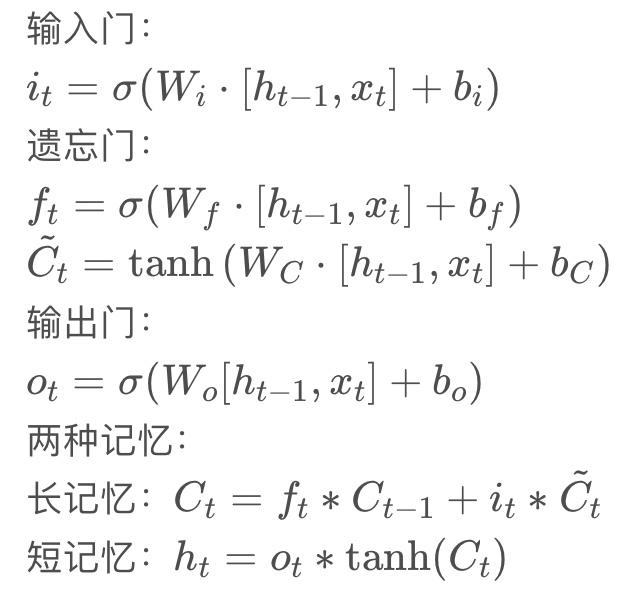

阅读过程中抓重点：

1. 要解决什么问题（领域+本文）
2. 创新点有哪些
3. 还有哪些待解决的问题（领域+本文）

对于拓扑多变量时间序列的异常检测任务是：给定个历史滑动窗口的数据$S(X\_t∣X\_{t−w:t−1},E)$来判定观测点$X\_t$的数据是否异常。

Mutivariate time series体现在哪里？

## Spatiotemporal

标题 “A Spatiotemporal Deep Learning Approach for Unsupervised Anomaly Detection in Cloud Systems”中的Spatiotemproal的解读：

- Temporal Model：时序模型（LSTM）
- Spatial Model：用metric构造出来的空间模型（Graph）

Multiple-Metrics拓扑信息的+组件级的输入构成了系统级的信息，可以更全面地了解整个运行系统。利用Multiple-Metrics就可以用来构造空间模型。

## GraphLSTM

那么Spatiotemporal是如何体现的？

图神经网络的特征提取器共享于来自不同组件的同类指标之间，有助于在统一的特征学习下捕获相同指标类型之间的相似模式。

GraphLSTM的主要思路是将LSTM中的全连接网络之前增加一个GNN，对拓扑信息和指标信息进行融合。

数据分为两类（如Fig.3、Fig.4所示）：

1. 指标矩阵，横坐标是节点Node，纵坐标是指标Metric。
2. 连接矩阵，主要是edge的向量矩阵，每个edge为一个列向量。

GraphLSTM的主要思路是将LSTM中的全连接网络之前增加一个GNN，对拓扑信息和指标信息进行融合。

对比一下LSTM的计算公式和融合后的公式，替换了外部输入。也就在之前添加了GNN作为拓扑信息和Metric信息的融合层，融合之后作为标准LSTM的输入。其中： “$∗g$” denotes the graph neural operator and “$∗$” denotes the Hadamard product。

融合公式：

LSTM原版公式：

VAE在这里面起什么作用？

RQ可以写7个？？！！没毛病。这7个RQ选取的角度其实很全面，非常值得参考。

两个数据集MBD和MMS可以看看里面长什么样子。

## 参考

- https://blog.csdn.net/qq_33431368/article/details/114464716 （总结1）
- https://dreamhomes.top/posts/202103111131/（总结2）
- https://ieeexplore.ieee.org/document/9228885/ （论文地址）
- https://github.com/QAZASDEDC/TopoMAD （数据集）
- https://blog.csdn.net/Geek_of_CSDN/article/details/86559464 （LSTM计算公式）